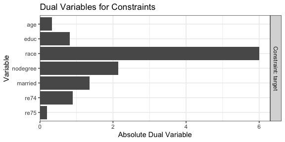

<!-- README.md is generated from README.Rmd. Please edit that file -->

# optweight: Optimization-Based Stable Balancing Weights 

[](https://cran.r-project.org/package=optweight)
[](https://cran.r-project.org/package=optweight)

*optweight* contains functions to estimate stable balancing weights that
balance covariates up to given thresholds. It solves a convex
optimization problem to minimize a function of the weights that captures
their variability (or divergence from a set of base weights). This is
the method described in Zubizarreta
([2015](#ref-zubizarretaStableWeightsThat2015)), Källberg and Waernbaum
([2023](#ref-kallbergLargeSampleProperties2023)), and Wang and
Zubizarreta ([2020](#ref-wangMinimalDispersionApproximately2020)).
*optweight* extends the method to multi-category, continuous, and
multivariate treatments and provides a simple user interface and
compatibility with the *cobalt* package for balance assessment. See
`vignette("optweight")` for a more thorough description of the package’s
capabilities.

To install *optweight*, use the code below:

``` r
#CRAN version
install.packages("optweight")

#Development version
pak::pkg_install("ngreifer/optweight")
```

Below is an example of estimating weights with *optweight* and assessing
balance on the covariates with *cobalt*.

``` r
library("optweight")
library("cobalt")

data("lalonde")

# Estimate weights
ow <- optweight(treat ~ age + educ + race + nodegree + married +
                  re74 + re75,
                data = lalonde,
                estimand = "ATT",
                tols = .01,
                min.w = 0)
ow
```

    #> An optweight object
    #>  - number of obs.: 614
    #>  - norm minimized: "l2"
    #>  - sampling weights: present
    #>  - base weights: present
    #>  - treatment: 2-category
    #>  - estimand: ATT (focal: 1)
    #>  - covariates: age, educ, race, nodegree, married, re74, re75

``` r
# Information about the weights
summary(ow)
```

    #> Summary of weights:
    #> 
    #> - Weight ranges:
    #>         Min                                  Max
    #> treated   1      ||                       1.    
    #> control   0 |---------------------------| 5.5885
    #> 
    #> - Units with 5 greatest weights by group:
    #>                                            
    #>               1      2      3      4      5
    #>  treated      1      1      1      1      1
    #>             423    388    226    196    118
    #>  control 5.2698 5.2985 5.3241 5.4795 5.5885
    #> 
    #>            L2    L1    L∞ # Zeros
    #> treated 0.    0.    0.          0
    #> control 1.663 1.302 4.588     231
    #> 
    #> - Effective Sample Sizes:
    #>            Control Treated
    #> Unweighted   429.      185
    #> Weighted     113.9     185

``` r
# Covariate balance
bal.tab(ow)
```

    #> Balance Measures
    #>                Type Diff.Adj
    #> age         Contin.     0.01
    #> educ        Contin.     0.01
    #> race_black   Binary     0.01
    #> race_hispan  Binary     0.00
    #> race_white   Binary    -0.01
    #> nodegree     Binary     0.01
    #> married      Binary    -0.01
    #> re74        Contin.    -0.01
    #> re75        Contin.     0.01
    #> 
    #> Effective sample sizes
    #>            Control Treated
    #> Unadjusted   429.      185
    #> Adjusted     113.9     185

We can see that all standardized mean differences are at or below .01 in
absolute value, as requested using the `tols` argument. Because we set
`min.w = 0`, some units received weights of 0, effectively dropping them
from the sample (by default, the smallest weight allowed is $10^{-8}$).

We can use `plot()` to examine the dual variables for each constraint,
which represent how active that constraint is at the optimal point.
Highly active constraints affect the objective function value the most
when their tolerances are changed.

``` r
plot(ow)
```



We can see that `race` has the highest dual variable; relaxing the
constraint on `race` would yield the biggest improvement in effective
sample size, while tightening its constraint would yield the biggest
decrease in effective sample size.

The lower-level function `optweight.fit()` operates on the covariates
and treatment variables directly. `optweightMV()` supports multivariate
(i.e., multiple) treatments.

In addition to estimating balancing weights for estimating treatment
effects, *optweight* can estimate sampling weights for generalizing an
estimate to a new target population defined by covariate moments using
`optweight.svy()`.

To cite *optweight*, please use `citation("optweight")` to generate the
correct reference. Be sure to include the version of the package. Please
submit bug reports, questions, comments, or other issues to
<https://github.com/ngreifer/optweight/issues>.

## References

<div id="refs" class="references csl-bib-body hanging-indent"
entry-spacing="0">

<div id="ref-kallbergLargeSampleProperties2023" class="csl-entry">

Källberg, David, and Ingeborg Waernbaum. 2023. “Large Sample Properties
of Entropy Balancing Estimators of Average Causal Effects.”
*Econometrics and Statistics*, November.
<https://doi.org/10.1016/j.ecosta.2023.11.004>.

</div>

<div id="ref-wangMinimalDispersionApproximately2020" class="csl-entry">

Wang, Yixin, and Jose R. Zubizarreta. 2020. “Minimal Dispersion
Approximately Balancing Weights: Asymptotic Properties and Practical
Considerations.” *Biometrika* 107 (1): 93–105.
<https://doi.org/10.1093/biomet/asz050>.

</div>

<div id="ref-zubizarretaStableWeightsThat2015" class="csl-entry">

Zubizarreta, José R. 2015. “Stable Weights That Balance Covariates for
Estimation with Incomplete Outcome Data.” *Journal of the American
Statistical Association* 110 (511): 910–22.
<https://doi.org/10.1080/01621459.2015.1023805>.

</div>

</div>
