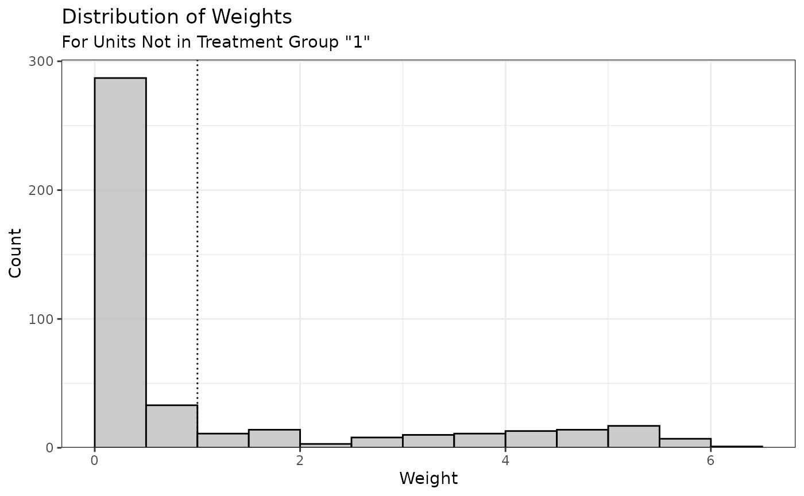

# Using optweight to Estimate Stable Balancing Weights

## Introduction

*optweight* implements stable balancing weighting (SBW) as described by
Zubizarreta ([2015](#ref-zubizarretaStableWeightsThat2015)) and Y. Wang
and Zubizarreta ([2020](#ref-wangMinimalDispersionApproximately2020)).
This involves estimating weights aimed at adjusting for confounding by
balancing covariates while minimizing some measure of variability of the
weights. SBW is also known as empirical balancing calibration weighting
([Chan, Yam, and Zhang
2016](#ref-chanGloballyEfficientNonparametric2016)) and entropy
balancing ([Källberg and Waernbaum
2023](#ref-kallbergLargeSampleProperties2023)). These methods are
related to inverse probability weighting (IPW), and there are some
equivalences between SBW and IPW ([Y. Wang and Zubizarreta
2020](#ref-wangMinimalDispersionApproximately2020)). While IPW typically
involves fitting a propensity score model for the probability of
receiving treatment, SBW estimates weights directly that balance the
covariates. The distinction between these two approaches is described in
detail by Chattopadhyay, Hase, and Zubizarreta
([2020](#ref-chattopadhyayBalancingVsModeling2020)).

SBW involves solving the following optimization problem:

\\\begin{array}{crcll} \min\limits\_{\mathbf{w}} f\left(\mathbf{w},
\mathbf{b},\mathbf{s}\right) & & & & \\ \text{s.t.} & \left\|
\bar{x}^{sw}\_{k,a} - \bar{x}^{sw}\_{k, a'} \right\| & \le & \delta_k &
\forall \\a, a'\\ \in \mathcal{A},\\ \forall k \in \\1, \dots, K\\ \\ &
\left\| \frac{1}{2} \left( \bar{x}^{sw}\_{k,a} + \bar{x}^{sw}\_{k, a'}
\right) - \bar{x}\_k^\* \right\| & \le & \varepsilon_k & \forall \\a,
a'\\ \in \mathcal{A},\\ \forall k \in \\1, \dots, K\\ \\ & w_i & \ge &
w\_\text{min} & \forall i \\ & \sum\limits\_{i:A_i=a}s_i w_i & = &
\sum\limits\_{i:A_i=a}s_i b_i & \forall a \in \mathcal{A} \end{array}\\

where

- \\\mathbf{w}=\\w_1, \dots, w_n\\\\ are the estimated weights
- \\\mathbf{s}=\\s_1, \dots, s_n\\\\ are sampling weights
- \\\mathbf{b}=\\b_1, \dots, b_n\\\\ are “base” weights
- \\f(\mathbf{w}, \mathbf{b}, \mathbf{s})\\ is the objective function to
  minimize—a function of the estimated weights, base weights, and
  sampling weights
- \\A_i\\ is a categorical treatment for unit \\i\\ taking on values \\a
  \in \mathcal{A}\\
- \\\bar{x}^{sw}\_{k,a}\\ is the weighted mean of covariate \\x_k\\ in
  treatment group \\a\\, weighted using the product of \\\mathbf{s}\\
  and \\\mathbf{w}\\ (i.e., \\\bar{x}^{sw}\_{k,a} =
  \frac{\sum\_{i:A_i=a} s_i w_i x\_{ki}}{\sum\_{i:A_i=a} s_i w_i}\\,
  where \\x\_{ki}\\ is the value of covariate \\\mathbf{x}\_k\\ for unit
  \\i\\)
- \\\delta_k\\ is the group balance tolerance for covariate \\k\\
- \\\varepsilon_k\\ is the target balance tolerance for covariate \\k\\
- \\\bar{x}\_k^\*\\ is the target value for covariate \\k\\
- \\w\_\text{min}\\ is the minimum weight allowed.

The interpretation of these constraints is as follows:

1.  **Group Balance.** The weighted covariate means are similar between
    groups (up to tolerance \\\delta_k\\).
2.  **Target Balance.** The midpoints between weighted covariate means
    in pairs of groups are similar to the target values (up to tolerance
    \\\varepsilon_k\\).
3.  **Weight Range.** All weights are larger than \\w\_\text{min}\\.
4.  **Weight Scale.** The weights sum to a fixed value in each group.

For a given dataset including treatment, covariates, sampling weights
(which may be all 1 if none are present), and base weights (which may be
all 1 if none are present), the user chooses \\\delta_k\\,
\\\bar{x}\_k^\*\\, \\\varepsilon_k\\, \\w\_\text{min}\\, and \\f\\.
Generally, \\f\\ represents a measure of dispersion from the base
weights, weighted by the sampling weights; see the section on
[`norm`](#norm) below.

Asymptotic properties of SBW are described in Y. Wang and Zubizarreta
([2020](#ref-wangMinimalDispersionApproximately2020)), though the
formulation in *optweight* differs slightly from the original
formulation in Y. Wang and Zubizarreta
([2020](#ref-wangMinimalDispersionApproximately2020)) by allowing for an
additional tuning parameter, \\\varepsilon_k\\, to control target
balance separately from group balance. In general, the weights are
precise and perform well, and adding approximate balance constraints
(i.e., using \\\delta_k\>0\\) tends to improve precision without greatly
affecting bias. There is also a weak double-robustness property to the
weights: the estimate is consistent if either the outcome model
corresponds to the balance constraints or the implicit propensity score
model corresponds to the true propensity score model. Different forms of
\\f\\ imply different assumptions about the propensity score model.
Allowing \\w\_\text{min}\\ to be negative allows for the possibility of
negative weights, which can improve precision but induce extrapolation.
It turns out that using a linear regression model for the outcome is
equivalent to using SBW with the \\L_2\\ norm, \\\delta_k=0\\, and
\\\varepsilon_k=0\\, and \\w\_\text{min}=-\infty\\ ([Chattopadhyay and
Zubizarreta 2023](#ref-chattopadhyayImpliedWeightsLinear2023)).

Often \\\bar{x}\_k^\*\\ are chosen to represent a known target group,
like the full sample when targeting the ATE or the treated group when
targeting the ATT. They can also be chosen to generalize the effect
estimate to an arbitrary target population ([Chattopadhyay, Cohn, and
Zubizarreta 2024](#ref-chattopadhyayOneStepWeightingGeneralize2024)) or
removed entirely to prioritize group balance over target balance
([Barnard, Huling, and Wolfson
2025](#ref-barnardPartiallyRetargetedBalancing2025)).

SBW can be generalized to continuous treatments, in which case instead
of balancing the covariate means, the treatment-covariate covariances
are constrained to be balanced. This was explored in Greifer
([2020](#ref-greiferEstimatingBalancingWeights2020)), Tübbicke
([2022](#ref-tubbickeEntropyBalancingContinuous2022)), and Vegetabile et
al. ([2021](#ref-vegetabileNonparametricEstimationPopulation2021)). SBW
can also be used to directly weight a sample to resemble a population,
without needing to balance two treatment groups. This also known known
as matching-adjusted indirect comparison Signorovitch et al.
([2010](#ref-signorovitchComparativeEffectivenessHeadtoHead2010)).

*optweight* contains functionality to perform these operations and
assess their performance. It was designed to be user-friendly,
compatible with the syntax used with
[*WeightIt*](https://ngreifer.github.io/WeightIt/), and supported by
[*cobalt*](https://ngreifer.github.io/cobalt/) for balance assessment,
at the possible expense of some flexibility. The
[*sbw*](https://cran.r-project.org/package=sbw) package also implements
some of these methods, prioritizing different aspects of the estimation.
Entropy balancing is also implemented in *WeightIt*, which can also call
*optweight* to provide a simpler interface to SBW.

## Using *optweight*

The main function in *optweight* is
[`optweight()`](https://ngreifer.github.io/optweight/reference/optweight.md),
which uses a formula interface to specify the treatment, covariates, and
balance tolerance. Other functions in *optweight* facilitate
specification of more detailed parameters and support diagnostics.

Below, we’ll use
[`optweight()`](https://ngreifer.github.io/optweight/reference/optweight.md)
to estimate weights that balance the covariates in an observational
study. We’ll use the `lalonde` dataset in *cobalt* and target the ATT
first. The treatment is `treat`, the outcome is `re78`, and the other
variables are the covariates to balance.

``` r
library(optweight)

data("lalonde", package = "cobalt")

head(lalonde)
```

| treat | age | educ | race   | married | nodegree | re74 | re75 |    re78 |
|------:|----:|-----:|:-------|--------:|---------:|-----:|-----:|--------:|
|     1 |  37 |   11 | black  |       1 |        1 |    0 |    0 |  9930.0 |
|     1 |  22 |    9 | hispan |       0 |        1 |    0 |    0 |  3595.9 |
|     1 |  30 |   12 | black  |       0 |        0 |    0 |    0 | 24909.5 |
|     1 |  27 |   11 | black  |       0 |        1 |    0 |    0 |  7506.1 |
|     1 |  33 |    8 | black  |       0 |        1 |    0 |    0 |   289.8 |
|     1 |  22 |    9 | black  |       0 |        1 |    0 |    0 |  4056.5 |

[`optweight()`](https://ngreifer.github.io/optweight/reference/optweight.md)
can be used simply by supplying the treatment and covariates to the
`formula` argument, the dataset to the `data` argument, and the estimand
to the `estimand` argument (here, the ATT). By default,
[`optweight()`](https://ngreifer.github.io/optweight/reference/optweight.md)
minimizes the \\L_2\\ norm, requires exact mean balance on the
covariates (i.e., \\\delta_k=0\\), requires exact mean target balance on
the covariates (i.e., \\\varepsilon_k=0\\), and requires all weights to
be greater than \\w\_\text{min}=10^{-8}\\.

``` r
ow <- optweight(treat ~ age + educ + race + married +
                  nodegree + re74 + re75,
                data = lalonde,
                estimand = "ATT")
ow
```

    ## An optweight object
    ##  - number of obs.: 614
    ##  - norm minimized: "l2"
    ##  - sampling weights: present
    ##  - base weights: present
    ##  - treatment: 2-category
    ##  - estimand: ATT (focal: 1)
    ##  - covariates: age, educ, race, married, nodegree, re74, re75

Using
[`cobalt::bal.tab()`](https://ngreifer.github.io/cobalt/reference/bal.tab.html)
on the output computes the weighted balance statistics; in particular,
it produce weighted (standardized) mean differences for all covariates
as well as the effective sample size (ESS), which represents the
approximate size of an unweighted sample that produces the same
precision as the weighted sample.

``` r
cobalt::bal.tab(ow)
```

    ## Balance Measures
    ##                Type Diff.Adj
    ## age         Contin.       -0
    ## educ        Contin.       -0
    ## race_black   Binary       -0
    ## race_hispan  Binary        0
    ## race_white   Binary        0
    ## married      Binary       -0
    ## nodegree     Binary       -0
    ## re74        Contin.       -0
    ## re75        Contin.       -0
    ## 
    ## Effective sample sizes
    ##            Control Treated
    ## Unadjusted   429.      185
    ## Adjusted     108.6     185

As expected, all mean differences are exactly 0 in the weighted sample.
We can use [`summary()`](https://rdrr.io/r/base/summary.html) to examine
some properties of the weights:

``` r
summary(ow)
```

    ##                   Summary of weights
    ## - Weight ranges:
    ## 
    ##         Min                                 Max
    ## treated   1      ||                       1.   
    ## control   0 |---------------------------| 6.002
    ## 
    ## - Units with the 5 most extreme weights by group:
    ##                                      
    ##              1     2    3     4     5
    ##  treated     1     1    1     1     1
    ##            423   388  226   196   118
    ##  control 5.568 5.602 5.67 5.922 6.002
    ## 
    ## 
    ## - Weight statistics:
    ## 
    ##            L2    L1    L∞ Rel Ent # Zeros
    ## treated 0.    0.    0.       0.         0
    ## control 1.717 1.339 5.002    1.23       0
    ## 
    ## - Effective Sample Sizes:
    ## 
    ##            Control Treated
    ## Unweighted   429.      185
    ## Weighted     108.6     185

[`summary()`](https://rdrr.io/r/base/summary.html) produces some
information about the distribution of weights, including different
measures of the dispersion of the weights, each of which corresponds to
one of the allowed objective functions to minimize. `L2` is the square
root of the mean squared deviation of the estimated weights from the
base weights (i.e., the \\L_2\\ divergence); here, the base weights are
all 1. See the help page for
[`summary.optweight()`](https://ngreifer.github.io/optweight/reference/summary.optweight.md)
for more information about the other statistics. Lastly,
[`summary()`](https://rdrr.io/r/base/summary.html) produces the weighted
and original (effective) samples sizes.

We can use [`plot()`](https://rdrr.io/r/graphics/plot.default.html) on
the [`summary()`](https://rdrr.io/r/base/summary.html) output to
visualize the distribution of the weights:

``` r
summary(ow) |> plot()
```



Because we targeted the ATT, only the weights for the control group are
displayed (the treated group weights are all 1).

Below, we’ll adjust a few arguments to see what affects they have on the
weights.

### Balance tolerance: `tols`

The group balance tolerance is controlled by the `tols` argument. This
can either be a single value applied to all covariates or a vector with
a value for each covariate. By default, `tols = 0`. Let’s see what
happens when we increase `tols` to .02.

``` r
ow2 <- optweight(treat ~ age + educ + race + married +
                   nodegree + re74 + re75,
                 data = lalonde,
                 estimand = "ATT",
                 tols = .02)

cobalt::bal.tab(ow2)
```

    ## Balance Measures
    ##                Type Diff.Adj
    ## age         Contin.     0.02
    ## educ        Contin.     0.02
    ## race_black   Binary     0.02
    ## race_hispan  Binary     0.00
    ## race_white   Binary    -0.02
    ## married      Binary    -0.02
    ## nodegree     Binary     0.02
    ## re74        Contin.    -0.02
    ## re75        Contin.     0.02
    ## 
    ## Effective sample sizes
    ##            Control Treated
    ## Unadjusted   429.      185
    ## Adjusted     118.8     185

Now, all mean differences are less than .02[¹](#fn1).

Allowing for more relaxed imbalance also increases the ESS. The \\L_2\\
statistic has shrunk correspondingly:

``` r
summary(ow2, weight.range = FALSE)
```

    ##                   Summary of weights
    ## 
    ## - Weight statistics:
    ## 
    ##            L2    L1    L∞ Rel Ent # Zeros
    ## treated 0.    0.    0.      0.          0
    ## control 1.616 1.267 4.212   1.118       0
    ## 
    ## - Effective Sample Sizes:
    ## 
    ##            Control Treated
    ## Unweighted   429.      185
    ## Weighted     118.8     185

To supply each covariate with its own balance tolerance, a named vector
must be supplied. This can sometimes be a little tedious, so there is a
helper function,
[`process_tols()`](https://ngreifer.github.io/optweight/reference/process_tols.md),
that simplifies this. Give
[`process_tols()`](https://ngreifer.github.io/optweight/reference/process_tols.md)
the formula and dataset (and, optionally, an initial tolerance value or
vector thereof), and it will return a modifiable vector of balance
tolerances that can be supplied to
[`optweight()`](https://ngreifer.github.io/optweight/reference/optweight.md).

``` r
tols <- process_tols(treat ~ age + educ + race + married +
                       nodegree + re74 + re75,
                     data = lalonde,
                     tols = .02)
tols
```

    ##  - tols:
    ##      age     educ     race  married nodegree     re74     re75 
    ##     0.02     0.02     0.02     0.02     0.02     0.02     0.02

Here, we’ll relax the constraint on `race` by setting its group balance
tolerance to .07 and then re-estimate the weights.

``` r
tols["race"] <- .07

tols
```

    ##  - tols:
    ##      age     educ     race  married nodegree     re74     re75 
    ##     0.02     0.02     0.07     0.02     0.02     0.02     0.02

``` r
ow3 <- optweight(treat ~ age + educ + race + married +
                   nodegree + re74 + re75,
                 data = lalonde,
                 estimand = "ATT",
                 tols = tols)

cobalt::bal.tab(ow3)
```

    ## Balance Measures
    ##                Type Diff.Adj
    ## age         Contin.     0.02
    ## educ        Contin.     0.02
    ## race_black   Binary     0.07
    ## race_hispan  Binary     0.00
    ## race_white   Binary    -0.07
    ## married      Binary    -0.02
    ## nodegree     Binary     0.02
    ## re74        Contin.    -0.02
    ## re75        Contin.     0.02
    ## 
    ## Effective sample sizes
    ##            Control Treated
    ## Unadjusted   429.      185
    ## Adjusted     132.7     185

We can see that for all covariates other than `race`, the mean
differences are at or below .02, but for `race`, the mean differences
are at or below .07. This led to an increase in ESS due to the relaxed
constraints.

### Objective function: `norm`

The `norm` argument controls which objective function is used. See the
table below for the allowable values of `norm`, their names, and their
formulas:

| `norm`      | Name                 | \\f\left(\mathbf{w}, \mathbf{b},\mathbf{s}\right)\\   |
|-------------|----------------------|-------------------------------------------------------|
| `"l2"`      | \\L_2\\ norm         | \\\frac{1}{n}\sum_i{s_i(w_i-b_i)^2}\\                 |
| `"l1"`      | \\L_1\\ norm         | \\\frac{1}{n} \sum_i {s_i \vert w_i - b_i \vert}\\    |
| `"linf"`    | \\L\_\infty\\ norm   | \\\max_i {\vert w_i - b_i \vert}\\                    |
| `"entropy"` | Relative entropy     | \\\frac{1}{n} \sum_i {s_i w_i \log \frac{w_i}{b_i}}\\ |
| `"log"`     | Sum of negative logs | \\\frac{1}{n} \sum_i {-s_i \log \frac{w_i}{b_i}}\\    |

The \\L_2\\ norm is the default. Of all the objective functions, the
most thorough theoretical work has been done on the \\L_2\\ norm and
relative entropy, and these tend to be the easiest to optimize.
Weighting by minimizing the relative entropy is also known as “entropy
balancing” ([Hainmueller
2012](#ref-hainmuellerEntropyBalancingCausal2012); [Källberg and
Waernbaum 2023](#ref-kallbergLargeSampleProperties2023); [Zhao and
Percival 2017](#ref-zhaoEntropyBalancingDoubly2017)) and is also
available in *WeightIt*, which uses a more parsimonious representation
of the problem. Weighting by minimizing the sum of negative logs is
equivalent to nonparametric covariate balancing propensity score
(npCBPS) weighting ([Fong, Hazlett, and Imai
2018](#ref-fongCovariateBalancingPropensity2018)), which maximizes the
empirical likelihood of the data to estimate the weights. A penalized
version of npCBPS is available in
[*CBPS*](https://cran.r-project.org/package=CBPS) and in *WeightIt*
(which calls functions from *CBPS*), but *optweight* offers additional
options not possible in those packages, such as specifying balance
tolerances, targets, and different estimands.

Different solvers are available for each norm; see the
[`optweight()`](https://ngreifer.github.io/optweight/reference/optweight.md)
help page for details.

Below, we’ll minimize the \\L_2\\ norm, \\L_1\\ norm, \\L\_\infty\\
norm, and relative entropy and see how those choices affect the
properties of the weights.

``` r
# L2 norm
ow_l2 <- optweight(treat ~ age + educ + race + married +
                     nodegree + re74 + re75,
                   data = lalonde,
                   estimand = "ATT",
                   norm = "l2")

# L1 norm
ow_l1 <- optweight(treat ~ age + educ + race + married +
                     nodegree + re74 + re75,
                   data = lalonde,
                   estimand = "ATT",
                   norm = "l1")

# L-infinity norm
ow_linf <- optweight(treat ~ age + educ + race + married +
                       nodegree + re74 + re75,
                     data = lalonde,
                     estimand = "ATT",
                     norm = "linf",
                     eps = 1e-5) # to improve convergence
# Relative entropy
ow_re <- optweight(treat ~ age + educ + race + married +
                     nodegree + re74 + re75,
                   data = lalonde,
                   estimand = "ATT",
                   norm = "entropy")
```

Below is a table of the statistics (rows) for the control group for each
norm minimized (columns).

|         |    l2 |    l1 |  linf |    RE |
|:--------|------:|------:|------:|------:|
| L2      | 1.717 | 2.017 | 1.877 | 1.832 |
| L1      | 1.339 | 1.281 | 1.548 | 1.287 |
| L∞      | 5.002 | 9.924 | 3.577 | 8.421 |
| Rel Ent | 1.230 | 1.227 | 1.500 | 1.101 |

We can see that minimizing the \\L_2\\ norm yields weights that have the
lowest \\L_2\\ divergence, minimizing the \\L_1\\ norm yields weights
that have the lowest \\L_1\\ divergence, minimizing the \\L\_\infty\\
norm yields weights that have the lowest \\L\_\infty\\ divergence, and
minimizing the relative entropy yields weights that have the lowest
relative entropy. The \\L_2\\ divergence has the closest correspondence
to the ESS (they have a 1:1 relationship), but there are some
theoretical reasons to prefer other norms, especially when they
correspond to certain assumptions about the true propensity score model.
See Källberg and Waernbaum
([2023](#ref-kallbergLargeSampleProperties2023)) for more information on
these assumptions.

### Representativeness: `estimand`, `targets`, and `target.tols`

Representativeness is an important but occasionally neglected aspect of
weighting. The degree to which a given weighted sample can be
representative of a specific target population can be controlled by the
`estimand`, `target`, and `target.tols` arguments, which we detail
below.

#### `estimand`

Different estimands can be targeted by supplying an argument to
`estimand`. Allowable estimands include the ATE, ATT, and ATC. These
ensure the covariate means in each group resemble those in the full
sample, the treated group, and the control group, respectively. For
example, setting `estimand = "ATE"` requests that both groups be
weighted so that the covariate means are equal to the covariate means in
the full sample, as demonstrated below.

The covariate means in the full sample can be computed using
[`cobalt::col_w_mean()`](https://ngreifer.github.io/cobalt/reference/balance-summary.html):

``` r
covs <- lalonde[-c(1, 9)]

cobalt::col_w_mean(covs)
```

    ##         age        educ  race_black race_hispan  race_white     married 
    ##     27.3632     10.2687      0.3958      0.1173      0.4870      0.4153 
    ##    nodegree        re74        re75 
    ##      0.6303   4557.5466   2184.9382

After estimating weights that target the ATE, we will see that the
weighted covariate means in each group are equal to those in the full
sample:

``` r
ow_ate <- optweight(treat ~ age + educ + race + married +
                      nodegree + re74 + re75,
                    data = lalonde,
                    estimand = "ATE")

cobalt::bal.tab(ow_ate, disp = "m")
```

    ## Balance Measures
    ##                Type  M.0.Adj  M.1.Adj Diff.Adj
    ## age         Contin.   27.363   27.363        0
    ## educ        Contin.   10.269   10.269        0
    ## race_black   Binary    0.396    0.396        0
    ## race_hispan  Binary    0.117    0.117        0
    ## race_white   Binary    0.487    0.487       -0
    ## married      Binary    0.415    0.415        0
    ## nodegree     Binary    0.630    0.630        0
    ## re74        Contin. 4557.547 4557.547        0
    ## re75        Contin. 2184.938 2184.938        0
    ## 
    ## Effective sample sizes
    ##            Control Treated
    ## Unadjusted   429.   185.  
    ## Adjusted     343.5   50.72

#### `targets`

In addition to targeting a natural sample, it’s also possible to target
a specific population characterized by covariate means \\\bar{x}\_k^\*\\
by supplying an argument to `targets`[²](#fn2). The theory behind this
methodology is described by Chattopadhyay, Cohn, and Zubizarreta
([2024](#ref-chattopadhyayOneStepWeightingGeneralize2024)). To request a
different target population,
[`process_targets()`](https://ngreifer.github.io/optweight/reference/process_targets.md)
can be used to create a vector of target means, which are supplied to
the `targets` argument of
[`optweight()`](https://ngreifer.github.io/optweight/reference/optweight.md).

``` r
targets1 <- process_targets(~ age + educ + race + married +
                              nodegree + re74 + re75,
                            data = lalonde)

targets1
```

    ##  - targets:
    ##         age        educ  race_black race_hispan  race_white     married 
    ##     27.3632     10.2687      0.3958      0.1173      0.4870      0.4153 
    ##    nodegree        re74        re75 
    ##      0.6303   4557.5466   2184.9382

By default,
[`process_targets()`](https://ngreifer.github.io/optweight/reference/process_targets.md)
computes the mean of each covariate in the full sample. These can be
modified similarly to `tols` to specify target means. Note that for
categorical covariates, the proportions in the groups must sum to 1.

``` r
targets1["age"] <- 35
targets1[c("race_black", "race_hispan", "race_white")] <- c(.5, .3, .2)

targets1
```

    ##  - targets:
    ##         age        educ  race_black race_hispan  race_white     married 
    ##     35.0000     10.2687      0.5000      0.3000      0.2000      0.4153 
    ##    nodegree        re74        re75 
    ##      0.6303   4557.5466   2184.9382

We can supply these to
[`optweight()`](https://ngreifer.github.io/optweight/reference/optweight.md)
to request that the covariate means in the weighted sample are equal to
these target means. We need to set `estimand = NULL` to ensure the
`targets` are obeyed. Failing to do this will produce a warning.

``` r
ow_target1 <- optweight(treat ~ age + educ + race + married +
                          nodegree + re74 + re75,
                        data = lalonde,
                        targets = targets1,
                        estimand = NULL)

cobalt::bal.tab(ow_target1, disp = "m")
```

    ## Balance Measures
    ##                Type  M.0.Adj  M.1.Adj Diff.Adj
    ## age         Contin.   35.000   35.000       -0
    ## educ        Contin.   10.269   10.269       -0
    ## race_black   Binary    0.500    0.500       -0
    ## race_hispan  Binary    0.300    0.300        0
    ## race_white   Binary    0.200    0.200        0
    ## married      Binary    0.415    0.415       -0
    ## nodegree     Binary    0.630    0.630       -0
    ## re74        Contin. 4557.547 4557.547       -0
    ## re75        Contin. 2184.938 2184.938       -0
    ## 
    ## Effective sample sizes
    ##            Control Treated
    ## Unadjusted   429.    185. 
    ## Adjusted     133.5    25.6

The treatment effect estimate from this method of weighting would have
the interpretation of the estimate from a population with similar means
to those of the sample but with a mean age of 35 years (older than the
original sample) and a racial profile of 50% Black, 30% Hispanic, and
20% white.

It may be that representativeness to a specific target population is
only desired for a subset of variables, e.g., those expected to be
effect modifiers. We can remove constraints on target balance entirely
for certain variable by setting their target values to `NA`. This can be
especially helpful in cases of low overlap, as described by Barnard,
Huling, and Wolfson
([2025](#ref-barnardPartiallyRetargetedBalancing2025)). We do this
below, setting the targets for the `race` categories to `NA`:

``` r
targets2 <- process_targets(~ age + educ + race + married +
                              nodegree + re74 + re75,
                            data = lalonde)

# Set race targets to NA
is.na(targets2[startsWith(names(targets2), "race_")]) <- TRUE

ow_target2 <- optweight(treat ~ age + educ + race + married +
                          nodegree + re74 + re75,
                        data = lalonde,
                        targets = targets2,
                        estimand = NULL)

cobalt::bal.tab(ow_target2, disp = "m")
```

    ## Balance Measures
    ##                Type  M.0.Adj  M.1.Adj Diff.Adj
    ## age         Contin.   27.363   27.363        0
    ## educ        Contin.   10.269   10.269        0
    ## race_black   Binary    0.451    0.451        0
    ## race_hispan  Binary    0.164    0.164       -0
    ## race_white   Binary    0.386    0.386       -0
    ## married      Binary    0.415    0.415        0
    ## nodegree     Binary    0.630    0.630        0
    ## re74        Contin. 4557.547 4557.547        0
    ## re75        Contin. 2184.938 2184.938        0
    ## 
    ## Effective sample sizes
    ##            Control Treated
    ## Unadjusted   429.   185.  
    ## Adjusted     299.5   63.03

The resulting weights still ensure between-group balance (up to the
supplied `tols`), but the resulting weighted means for the untargeted
variables are those that happened to optimize the norm of the weights.
We can even relax all target constraints to solely prioritize
between-group balance by setting `targets = NA`.

``` r
ow_target3 <- optweight(treat ~ age + educ + race + married +
                          nodegree + re74 + re75,
                        data = lalonde,
                        targets = NA,
                        estimand = NULL)

cobalt::bal.tab(ow_target3, disp = "m")
```

    ## Balance Measures
    ##                Type  M.0.Adj  M.1.Adj Diff.Adj
    ## age         Contin.   25.877   25.877       -0
    ## educ        Contin.   10.318   10.318        0
    ## race_black   Binary    0.454    0.454       -0
    ## race_hispan  Binary    0.166    0.166        0
    ## race_white   Binary    0.380    0.380        0
    ## married      Binary    0.319    0.319       -0
    ## nodegree     Binary    0.626    0.626       -0
    ## re74        Contin. 3316.369 3316.369        0
    ## re75        Contin. 1994.888 1994.888        0
    ## 
    ## Effective sample sizes
    ##            Control Treated
    ## Unadjusted   429.   185.  
    ## Adjusted     283.1   76.99

This yields a kind of “overlap” weights that target whichever population
optimizes the objective function of the weights subject to between-group
balance alone ([Kallus and Santacatterina
2019](#ref-kallusOptimalEstimationGeneralized2019)).

#### `target.tols`

Between eschewing target balance altogether and requiring exact target
balance is allowing for inexact target balance by using `target.tols`,
which is specified like to `tols` argument. `target.tols` controls
\\\varepsilon_k\\, i.e., how far the midpoint between group means can
vary from the specified target mean. As with `tols`, this can be applied
to a subset of covariates or to all of them simultaneously.

Previously, we used
[`optweight()`](https://ngreifer.github.io/optweight/reference/optweight.md)
to target a specific target population defined by `targets1`; the
resulting weights are stored in `ow_target1`. We can increase the ESS by
relaxing the target balance constraint on `race`. To do this, we create
a new vector of target balance tolerances using
[`process_tols()`](https://ngreifer.github.io/optweight/reference/process_tols.md)
and modify the value for `race`.

``` r
target.tols1 <- process_tols(treat ~ age + educ + race + married +
                               nodegree + re74 + re75,
                             data = lalonde)

target.tols1["race"] <- .07

target.tols1
```

    ##  - tols:
    ##      age     educ     race  married nodegree     re74     re75 
    ##     0.00     0.00     0.07     0.00     0.00     0.00     0.00

We can supply this vector of target balance tolerances to the
`target.tols` argument of
[`optweight()`](https://ngreifer.github.io/optweight/reference/optweight.md)
to relax the target balance constraint without eliminating it entirely.

``` r
ow_target1b <- optweight(treat ~ age + educ + race + married +
                           nodegree + re74 + re75,
                         data = lalonde,
                         targets = targets1,
                         target.tols = target.tols1,
                         estimand = NULL)

cobalt::bal.tab(ow_target1b, disp = "m")
```

    ## Balance Measures
    ##                Type  M.0.Adj  M.1.Adj Diff.Adj
    ## age         Contin.   35.000   35.000       -0
    ## educ        Contin.   10.269   10.269       -0
    ## race_black   Binary    0.522    0.522       -0
    ## race_hispan  Binary    0.230    0.230        0
    ## race_white   Binary    0.248    0.248        0
    ## married      Binary    0.415    0.415       -0
    ## nodegree     Binary    0.630    0.630       -0
    ## re74        Contin. 4557.547 4557.547       -0
    ## re75        Contin. 2184.938 2184.938       -0
    ## 
    ## Effective sample sizes
    ##            Control Treated
    ## Unadjusted   429.   185.  
    ## Adjusted     148.4   31.26

Here we can see that the ESS has increased due to relaxing the
constraint on target balance, but the means for each `race` category are
still close to (i.e., within 0.07 of) their specified target values.

If we wanted to remove a covariate’s target balance constraint entirely,
we could set its target value to `NA`, as we did previously, or we can
set its target balance tolerance to `Inf`, which we do below for `age`:

``` r
target.tols1["age"] <- Inf

target.tols1
```

    ##  - tols:
    ##      age     educ     race  married nodegree     re74     re75 
    ##      Inf     0.00     0.07     0.00     0.00     0.00     0.00

``` r
ow_target1c <- optweight(treat ~ age + educ + race + married +
                           nodegree + re74 + re75,
                         data = lalonde,
                         targets = targets1,
                         target.tols = target.tols1,
                         estimand = NULL)

cobalt::bal.tab(ow_target1c, disp = "m")
```

    ## Balance Measures
    ##                Type  M.0.Adj  M.1.Adj Diff.Adj
    ## age         Contin.   26.495   26.495        0
    ## educ        Contin.   10.269   10.269       -0
    ## race_black   Binary    0.500    0.500        0
    ## race_hispan  Binary    0.230    0.230       -0
    ## race_white   Binary    0.270    0.270       -0
    ## married      Binary    0.415    0.415        0
    ## nodegree     Binary    0.630    0.630        0
    ## re74        Contin. 4557.547 4557.547        0
    ## re75        Contin. 2184.938 2184.938        0
    ## 
    ## Effective sample sizes
    ##            Control Treated
    ## Unadjusted   429.   185.  
    ## Adjusted     246.7   71.72

In general, it makes sense to maintain strict target balance constraints
on all covariates, relaxing them only when the covariate is not
suspected to be an effect modifier (i.e., so representativeness on that
covariate is not important) or when substantial precision gains can be
made by doing so. The [section on Dual Variables](#dual-variables) below
describes how to determine whether the latter scenario may be in effect.

### Sampling weights and base weights

Sampling weights and base weights are different forms of initially
computed weights that can be used to modify the optimization problem.
They are used for two different purposes, which we describe below.

#### Sampling weights: `s.weights`

Sampling weights are used when attempting to generalize the estimates
from a sample to a specific target population characterized by the
sampling weights. Some datasets come with sampling weights in order for
analyses using them to be valid. These weights can be supplied to the
`s.weights` argument of
[`optweight()`](https://ngreifer.github.io/optweight/reference/optweight.md).
This has three effects:

1.  The balance and target constraints correspond to the product of the
    estimated and sampling weights
2.  The target values for the covariates are weighted by the sampling
    weights (if not supplied through `targets`)
3.  The contribution of the estimated weights to the objective function
    is weighted by the sampling weights

Sampling weights are also used when bootstrapping using the fractional
weighted bootstrap ([Xu et al.
2020](#ref-xuApplicationsFractionalRandomWeightBootstrap2020a)), e.g.,
as implemented in the [*fwb*](https://ngreifer.github.io/fwb/) package;
see section [Estimating Effects](#est-effects) below. By default, when
`s.weights` is not specified, sampling weights are equal to 1.

#### Base weights: `b.weights`

Base weights are a set of initial weights that have some properties that
the user wants to retain while enforcing balance constraints. The
estimated weights are chosen to minimize their distance from the base
weights, where that distance corresponds to \\f\\. These weights can be
supplied to the `b.weights` argument of
[`optweight()`](https://ngreifer.github.io/optweight/reference/optweight.md).
By default, when not specified, base weights are equal to 1. An example
use of base weights would be to enforce balance on a set of IPW weights
estimated using a flexible model that is unable to exactly balance the
covariates. This strategy was used by one of the winning methods in the
2016 ACIC data competition ([Dorie et al.
2019](#ref-dorieAutomatedDoityourselfMethods2019)). We’ll demonstrate
this use of base weights below.

First, we’ll estimate propensity score weights using generalized boosted
modeling through *WeightIt*. This is a flexible machine learning model,
and we can request that features beyond the covariate means be balanced
by minimizing the largest Kolmogorov-Smirnov (KS) statistic in the
weighted sample.

``` r
# GBM IPW weights
W_gbm <- WeightIt::weightit(treat ~ age + educ + race + married +
                              nodegree + re74 + re75,
                            data = lalonde,
                            estimand = "ATT",
                            method = "gbm",
                            criterion = "ks.max")
```

Next we’ll use
[`optweight()`](https://ngreifer.github.io/optweight/reference/optweight.md)
to estimate a set of weights that differ as little as possible from
these estimated weights while enforcing exact balance on the covariate
means.

``` r
# SBW with GBM base weights
ow_bw <- optweight(treat ~ age + educ + race + married +
                     nodegree + re74 + re75,
                   data = lalonde,
                   estimand = "ATT",
                   b.weights = W_gbm$weights)
```

We’ll also estimate SBW weights with uniform base weights to see the
difference in the properties of the weights.

``` r
# SBW without base weights
ow <- optweight(treat ~ age + educ + race + married +
                  nodegree + re74 + re75,
                data = lalonde,
                estimand = "ATT")
```

Finally, we can look at balance on all three sets of weights on the
means and KS statistics.

``` r
# Mean diferences
cobalt::bal.tab(W_gbm, stats = "m",
                weights = list(ow_bw = ow_bw$weights,
                               ow = ow$weights))
```

    ## Balance Measures
    ##                 Type Diff.weightit Diff.ow_bw Diff.ow
    ## prop.score  Distance         0.577      0.571   1.782
    ## age          Contin.         0.053      0.000  -0.000
    ## educ         Contin.        -0.080     -0.000  -0.000
    ## race_black    Binary         0.017      0.000  -0.000
    ## race_hispan   Binary         0.002     -0.000   0.000
    ## race_white    Binary        -0.018     -0.000   0.000
    ## married       Binary         0.005      0.000  -0.000
    ## nodegree      Binary         0.062      0.000  -0.000
    ## re74         Contin.         0.111      0.000  -0.000
    ## re75         Contin.         0.126      0.000  -0.000
    ## 
    ## Effective sample sizes
    ##          Control Treated
    ## All       429.       185
    ## weightit   24.71     185
    ## ow_bw      24.54     185
    ## ow        108.64     185

``` r
# KS statistics
cobalt::bal.tab(W_gbm, stats = "ks",
                weights = list(ow_bw = ow_bw$weights,
                               ow = ow$weights))
```

    ## Balance Measures
    ##                 Type KS.weightit KS.ow_bw KS.ow
    ## prop.score  Distance       0.223    0.222 0.615
    ## age          Contin.       0.096    0.102 0.283
    ## educ         Contin.       0.069    0.057 0.042
    ## race_black    Binary       0.017    0.000 0.000
    ## race_hispan   Binary       0.002    0.000 0.000
    ## race_white    Binary       0.018    0.000 0.000
    ## married       Binary       0.005    0.000 0.000
    ## nodegree      Binary       0.062    0.000 0.000
    ## re74         Contin.       0.062    0.037 0.226
    ## re75         Contin.       0.096    0.056 0.140
    ## 
    ## Effective sample sizes
    ##          Control Treated
    ## All       429.       185
    ## weightit   24.71     185
    ## ow_bw      24.54     185
    ## ow        108.64     185

Looking at the mean differences (in the columns `Diff.weightit`,
`Diff.ow_bw`, and `Diff.ow` in the first table), we can see that the GBM
weights from *WeightIt* alone did not balance the covariate means,
whereas both set of SBW weights from *optweight* did. However, in the
second table, we can see big differences in the KS statistics between
the SBW weights that incorporated the base weights and those that
didn’t. The KS statistics for the SBW weights that incorporated the base
weights (listed in the `KS.ow_bw` column) are very close to those for
the GBM weights (listed in the `KS.weightit` column) because the
estimated weights are very close to the GBM weights. In contrast, the
SBW weights that didn’t incorporate the base weights have very high KS
statistics for some covariates (listed in the `KS.ow` column); they are
unable to take advantage of the distribution-balancing properties of the
original GBM weights.

In this way, incorporating the base weights provides a middle ground
between the GBM weights and the basic SBW weights: they ensure exact
balance on the means while attempting to retain as much similarity to
the GBM weights as possible, thereby inheriting some of their balancing
properties. Unfortunately, one of those properties is also a very low
ESS, though in this case, little ESS is lost by enforcing the additional
balance constraints. Using different norms with base weights can also be
more effective than using with them uniform base weights, as different
norms prioritize similarity to the base weights in ways that may retain
different properties[³](#fn3).

### Dual variables

Dual variables, also known as “shadow prices”, are part of the output of
the optimization problem that represent how “active” a given constraint
is at the optimum ([Zubizarreta
2015](#ref-zubizarretaStableWeightsThat2015)). A large dual variable
means that relaxing the constraint will allow the objective function to
reach a lower value. They are related to the coefficients on covariates
in a propensity score model, representing how much each covariate is
contributing to the estimation of the weights.

Zubizarreta ([2015](#ref-zubizarretaStableWeightsThat2015)) describes
the utility of dual variables after SBW: they can be used to determine
which covariates have constraints that can be relaxed to improve
precision and which covariates have constraints that can be tightened
without affecting precision. The dual variables are available in
[`optweight()`](https://ngreifer.github.io/optweight/reference/optweight.md)
output in the `duals` component, but they can also be plotted using
[`plot()`](https://rdrr.io/r/graphics/plot.default.html). They can also
be useful for diagnosing convergence failure; often, a constraint that
is impossible to meet will have a high dual variable when no solution
can be found.

Below, we’ll demonstrate how we can use the dual variables to see how to
modify constraints to try to take advantage of the bias-variance
trade-off. First we’ll estimate SBW weights with balance tolerances of
.02 for all covariates.

``` r
tols <- process_tols(treat ~ age + educ + race + married +
                       nodegree + re74 + re75,
                     data = lalonde,
                     tols = .02)

ow <- optweight(treat ~ age + educ + race + married +
                  nodegree + re74 + re75,
                data = lalonde,
                estimand = "ATT",
                tols = tols)

summary(ow, weight.range = FALSE)
```

    ##                   Summary of weights
    ## 
    ## - Weight statistics:
    ## 
    ##            L2    L1    L∞ Rel Ent # Zeros
    ## treated 0.    0.    0.      0.          0
    ## control 1.616 1.267 4.212   1.118       0
    ## 
    ## - Effective Sample Sizes:
    ## 
    ##            Control Treated
    ## Unweighted   429.      185
    ## Weighted     118.8     185

We can print the dual variables in the `duals` component of the output
object and plot them with
[`plot()`](https://rdrr.io/r/graphics/plot.default.html):

``` r
ow$duals
```

| component | constraint   | cov      |   dual |
|----------:|:-------------|:---------|-------:|
|         0 | weight range | NA       | 2.4615 |
|         1 | balance      | age      | 0.2449 |
|         1 | balance      | educ     | 0.6267 |
|         1 | balance      | race     | 5.6655 |
|         1 | balance      | married  | 1.0527 |
|         1 | balance      | nodegree | 1.6113 |
|         1 | balance      | re74     | 0.7150 |
|         1 | balance      | re75     | 0.0437 |

``` r
plot(ow)
```


From this, it’s clear that `race` has the largest dual variable, and
`re75` has the smallest. That means we can likely get the biggest gains
in ESS by relaxing the balance constraint for `race`, whereas tightening
the balance constraint for `re75` will have little effect on the ESS.
Below, we relax the balance constraint for `race` to .1.

``` r
tols["race"] <- .1

ow2 <- optweight(treat ~ age + educ + race + married +
                   nodegree + re74 + re75,
                 data = lalonde,
                 estimand = "ATT",
                 tols = tols)

summary(ow2, weight.range = FALSE)
```

    ##                   Summary of weights
    ## 
    ## - Weight statistics:
    ## 
    ##            L2    L1    L∞ Rel Ent # Zeros
    ## treated 0.    0.    0.       0.         0
    ## control 1.424 1.113 3.638    0.91       0
    ## 
    ## - Effective Sample Sizes:
    ## 
    ##            Control Treated
    ## Unweighted   429.      185
    ## Weighted     141.7     185

By relaxing the constraint on `race`, our ESS increased by quite a bit.
We would not see the same increase had we instead relaxed the constraint
on a covariate with a smaller dual variable, like `re75`. Below, we
restore all balance constraints to .02 and then set the balance
constraint for `re75` to .1.

``` r
tols[] <- .02
tols["re75"] <- .1

ow3 <- optweight(treat ~ age + educ + race + married +
                   nodegree + re74 + re75,
                 data = lalonde,
                 estimand = "ATT",
                 tols = tols)

summary(ow3, weight.range = FALSE)
```

    ##                   Summary of weights
    ## 
    ## - Weight statistics:
    ## 
    ##            L2    L1    L∞ Rel Ent # Zeros
    ## treated 0.    0.    0.      0.          0
    ## control 1.616 1.267 4.207   1.118       0
    ## 
    ## - Effective Sample Sizes:
    ## 
    ##            Control Treated
    ## Unweighted   429.      185
    ## Weighted     118.8     185

This had virtually no effect on the ESS (relative to all balance
tolerances being equal to .02). However, this also suggests we can
tighten the constraint on `re75` without much loss in ESS. Below, we
decrease the tolerance on `re75` to 0:

``` r
tols["re75"] <- 0

ow4 <- optweight(treat ~ age + educ + race + married +
                   nodegree + re74 + re75,
                 data = lalonde,
                 estimand = "ATT",
                 tols = tols)

summary(ow4, weight.range = FALSE)
```

    ##                   Summary of weights
    ## 
    ## - Weight statistics:
    ## 
    ##            L2    L1    L∞ Rel Ent # Zeros
    ## treated 0.    0.    0.       0.         0
    ## control 1.617 1.269 4.229    1.12       0
    ## 
    ## - Effective Sample Sizes:
    ## 
    ##            Control Treated
    ## Unweighted   429.      185
    ## Weighted     118.7     185

We see that despite the tighter tolerance, the ESS remains about the
same. For reference, below are the balance statistics and ESSs for all
four sets of weights:

``` r
cobalt::bal.tab(treat ~ age + educ + race + married +
                  nodegree + re74 + re75,
                data = lalonde,
                weights = list(ow  = ow$weights,
                               ow2 = ow2$weights,
                               ow3 = ow3$weights,
                               ow4 = ow4$weights))
```

    ## Balance Measures
    ##                Type Diff.ow Diff.ow2 Diff.ow3 Diff.ow4
    ## age         Contin.    0.02     0.02    0.020     0.02
    ## educ        Contin.    0.02     0.02    0.020     0.02
    ## race_black   Binary    0.02     0.10    0.020     0.02
    ## race_hispan  Binary    0.00     0.00    0.000     0.00
    ## race_white   Binary   -0.02    -0.10   -0.020    -0.02
    ## married      Binary   -0.02    -0.02   -0.020    -0.02
    ## nodegree     Binary    0.02     0.02    0.020     0.02
    ## re74        Contin.   -0.02    -0.02   -0.020    -0.02
    ## re75        Contin.    0.02     0.02    0.026    -0.00
    ## 
    ## Effective sample sizes
    ##     Control Treated
    ## All   429.      185
    ## ow    118.8     185
    ## ow2   141.7     185
    ## ow3   118.8     185
    ## ow4   118.7     185

Again we can see that relaxing the balance constraint for `race`
increases the ESS significantly, whereas either tightening or relaxing
the constraint for `re75` has little effect on the ESS.

Group balance constraints are not the only constraints that can be
relaxed; when an estimand other than the ATT is targeted, we also have
target balance constraints, and the constraint on the minimum of the
weights may be active as well (i.e., indicating that requiring the
weights to be positive limits the precision of the resulting weights).
Below, we demonstrate how these might differ by targeting the ATE:

``` r
ow <- optweight(treat ~ age + educ + race + married +
                   nodegree + re74 + re75,
                 data = lalonde,
                 estimand = "ATE")
```

Plotting the dual variables reveals separate dual variables for the
target and balance constraints:

``` r
plot(ow)
```


The group and target balance constraints can be modified independently
of each other using `tols` and `target.tols`, respectively. In this
case, if we believed `race` was a strong confounder but a weak effect
modifier, we may be more willing to relax its target balance constraints
over its group balance constraint.

We can also plot the sum of the dual variables for each type of
constraint to examine which set is most active by setting
`type = "constraints"` in
[`plot()`](https://rdrr.io/r/graphics/plot.default.html):

``` r
plot(ow, type = "constraints")
```


From this we can see that group balance and target constraints have
similar limiting effects on the optimization, whereas the weight range
(controlled by `min_w`) has little effect in this example.

### Multivariate treatments

It is possible to supply balance constraints for multiple (i.e.,
multivariate) treatments simultaneously to estimate a single set of
weights that satisfies them all. This approach is described by Chen and
Zhou ([2023](#ref-chenCausalEffectEstimation2023)) in the context of
multiple continuous treatments.
[`optweightMV()`](https://ngreifer.github.io/optweight/reference/optweightMV.md)
provides an interface to balancing multiple treatments and works
similarly to
[`optweight()`](https://ngreifer.github.io/optweight/reference/optweight.md),
though with the ability to supply multiple balancing formulas. Though
this can be used with conceptually distinct treatments, it can also
sometimes be useful to use it with multiple transformations of a single
treatment; for example, Greifer
([2020](#ref-greiferEstimatingBalancingWeights2020)) found that in order
to eliminate the bias due to certain kinds of imbalance with a
continuous treatment, the square of the centered treatment must be
uncorrelated with the covariates, in addition to the treatment itself
being uncorrelated with the covariates.

To use
[`optweightMV()`](https://ngreifer.github.io/optweight/reference/optweightMV.md),
supply a list of balancing formulas to the `formula.list` argument. The
`tols.list` argument must also be a list with a vector of tolerances for
each treatment, each with a value for each covariate. However, `targets`
should be a vector with a value for each unique covariate since one
cannot specify multiple targets for the same covariate. Below is example
(not run) of how to specify a call to
[`optweightMV()`](https://ngreifer.github.io/optweight/reference/optweightMV.md):

``` r
owmv <- optweightMV(list(t1 ~ x1 + x2 + x3,
                         t2 ~ x1 + x2 + x3,
                         t3 ~ x1 + x2 + x3),
                    data = data,
                    tols.list = list(c(x1 = .01, x2 = .01, x3 = .01),
                                     c(x1 = .02, x2 = .02, x3 = .02),
                                     c(x1 = .03, x2 = .03, x3 = .03)),
                    targets = c(x1 = 10, x2 = .34, x3 = 5.5))
```

The syntax can be abbreviated by supplying a single value in each
element of `tols.list` that is applied to all covariates, e.g.,
`tols.list = list(.01, .02, .03)`; or, if the same vector of balance
tolerance is desired for all covariates for all treatments, a list with
a single vector, e.g.,
`tols.list = list(c(x1 = .01, x2 = .01, x3 = .01))`; or, if the same
tolerance is desired for all covariates and all treatments, a list with
a single value, e.g., `tols.list = list(.02)`. `targets` can be omitted
to target the ATE (i.e., to balance the covariates at their means in the
sample), but no other estimands can be specified.

One might be tempted to use
[`optweightMV()`](https://ngreifer.github.io/optweight/reference/optweightMV.md)
to estimate balancing weights for longitudinal treatments. While this is
possible, it’s not as simple as supplying a balancing formula for each
treatment balancing the treatment and covariate history to that
treatment ([Yiu and Su 2020](#ref-yiuJointCalibratedEstimation2020)).
Zhou and Wodtke ([2020](#ref-zhouResidualBalancingMethod2020)) describe
how to specify balance constraints for entropy balancing with
longitudinal treatments, and they involve balancing not the covariate
directly but rather the residuals in regressions of the covariates on
treatment and covariate histories. Functionality for this specific
method is not present in *optweight*, but is available in the
[*rbw*](https://cran.r-project.org/package=rbw) package. It may be
possible to implement this in *optweight* manually, but I cannot advise
on how to do so.

### `optweight.svy()`

When the goal is not to balance treatment groups to each other or to
some target population but rather to balance one sample to a target
distribution, one can use
[`optweight.svy()`](https://ngreifer.github.io/optweight/reference/optweight.svy.md)
instead of
[`optweight()`](https://ngreifer.github.io/optweight/reference/optweight.md).
The `.svy` suffix is an indication that can be used as a method to
generate survey weights so that the sample generalizes to a population
of interest with specific means.
[`optweight.svy()`](https://ngreifer.github.io/optweight/reference/optweight.svy.md)
works just like
[`optweight()`](https://ngreifer.github.io/optweight/reference/optweight.md)
except that no treatment variable is specified and `targets` should be
specified.

This is useful in the context of matching-adjusted indirect comparison
(MAIC, [Signorovitch et al.
2010](#ref-signorovitchComparativeEffectivenessHeadtoHead2010)), which
involves weighting a given trial sample to resemble the covariate
distribution of some other trial’s sample. MAIC as originally described
is equivalent to entropy balancing ([Phillippo et al.
2020](#ref-phillippoEquivalenceEntropyBalancing2020)), which can be
requested by setting `norm = "entropy"`.

Below, we demonstrate weighting the control subset of `lalonde` to
resemble a specific target population. As with `optweightit()`, it can
be helpful to use
[`process_targets()`](https://ngreifer.github.io/optweight/reference/process_targets.md)
to simplify specification of the covariates means. If all variables in
the dataset are to be specified, the formula can be omitted (for both
[`process_targets()`](https://ngreifer.github.io/optweight/reference/process_targets.md)
and
[`optweight.svy()`](https://ngreifer.github.io/optweight/reference/optweight.svy.md)).

``` r
lalonde_c <- subset(lalonde, treat == 0,
                    select = -c(treat))

targets <- process_targets(lalonde_c)

targets
```

    ##  - targets:
    ##         age        educ  race_black race_hispan  race_white     married 
    ##     28.0303     10.2354      0.2028      0.1422      0.6550      0.5128 
    ##    nodegree        re74        re75        re78 
    ##      0.5967   5619.2365   2466.4844   6984.1697

To request individual means, the targets can be set to those values. To
allow a covariate mean to vary freely, one can either omit it from the
calls to
[`process_targets()`](https://ngreifer.github.io/optweight/reference/process_targets.md)
and
[`optweight.svy()`](https://ngreifer.github.io/optweight/reference/optweight.svy.md)
or set the target value to `NA`. We’ll do that for `re78`, and set
specific targets for the other variables except `re75`, which we’ll
leave at its mean.

``` r
targets["age"] <- 40
targets["educ"] <- 9
targets[c("race_black", "race_hispan", "race_white")] <- c(.2, .2, .6)
targets["married"] <- .6
targets["nodegree"] <- .6
targets["re74"] <- 1000
is.na(targets["re78"]) <- TRUE

targets
```

    ##  - targets:
    ##         age        educ  race_black race_hispan  race_white     married 
    ##        40.0         9.0         0.2         0.2         0.6         0.6 
    ##    nodegree        re74        re75        re78 
    ##         0.6      1000.0      2466.5          NA

We can supply these to
[`optweight.svy()`](https://ngreifer.github.io/optweight/reference/optweight.svy.md).
This time we’ll set `min.w` to 0 to allow those with weights of 0 to be
effectively dropped from the sample.

``` r
ow_s <- optweight.svy(lalonde_c,
                      targets = targets,
                      min.w = 0)

ow_s
```

    ## An optweight.svy object
    ##  - number of obs.: 429
    ##  - norm minimized: "l2"
    ##  - sampling weights: present
    ##  - base weights: present
    ##  - covariates: age, educ, race, married, nodegree, re74, re75, re78

``` r
summary(ow_s)
```

    ##                   Summary of weights
    ## - Weight ranges:
    ## 
    ##     Min                                 Max
    ## all   0 |---------------------------| 13.54
    ## 
    ## - Units with the 5 most extreme weights:
    ##                                      
    ##        404   152    111     19     16
    ##  all 9.488 9.669 11.326 11.429 13.537
    ## 
    ## 
    ## - Weight statistics:
    ## 
    ##        L2  L1    L∞ # Zeros
    ## all 2.237 1.5 12.54     307
    ## 
    ## - Effective Sample Sizes:
    ## 
    ##             Total
    ## Unweighted 429.  
    ## Weighted    71.44

We can see that the weights required to move the sample toward our
specified target decrease the ESS by quite a bit, and several units were
given weights of 0. This can actually be a good thing if it means less
data needs to be collected since those with weights of 0 are not
necessary for subsequent analysis. We can examine the weighted covariate
means using `cobalt::col_w_means()` as before, with the estimated
weights supplied to `s.weights`:

``` r
cobalt::col_w_mean(lalonde_c, s.weights = ow_s$weights)
```

    ##         age        educ  race_black race_hispan  race_white     married 
    ##        40.0         9.0         0.2         0.2         0.6         0.6 
    ##    nodegree        re74        re75        re78 
    ##         0.6      1000.0      2466.5      4725.6

We can see that the weighted mean of `re78` is whatever minimized the
\\L_2\\ norm of the weights since no constraint was placed on it. As
with
[`optweight()`](https://ngreifer.github.io/optweight/reference/optweight.md),
we can see how much each constraint contributed to the increase in
variability by examining the dual variables:

``` r
plot(ow_s)
```


Here it’s clear that the constraint on `re74` is contributing the most,
and that relaxing the constraint would have the greatest impact on ESS.
The constraint can be relaxed either by changing the target to one
closer to that of the original data (or closer to where it would be if
no constraint was placed on `re74`) or by setting a more relaxed
tolerance for `re74` using `tols`. We’ll use the latter option below:

``` r
tols <- process_tols(lalonde_c, tols = 0)

tols["re74"] <- 300

tols
```

    ##  - tols:
    ##      age     educ     race  married nodegree     re74     re75     re78 
    ##        0        0        0        0        0      300        0        0

Here we set the tolerance for `re74` to be 300. We need to set
`std.cont = FALSE` to tell
[`optweight.svy()`](https://ngreifer.github.io/optweight/reference/optweight.svy.md)
that the tolerance for continuous variables should be in raw units, not
standardized units. Now we can interpret our constraint as allowing the
weighted mean for `re74` to be within 300 of its specified target of
1000.

``` r
ow_s2 <- optweight.svy(lalonde_c,
                       targets = targets,
                       min.w = 0,
                       tols = tols,
                       std.cont = FALSE)

summary(ow_s2, weight.range = FALSE)
```

    ##                   Summary of weights
    ## 
    ## - Weight statistics:
    ## 
    ##       L2   L1    L∞ # Zeros
    ## all 2.07 1.44 10.68     290
    ## 
    ## - Effective Sample Sizes:
    ## 
    ##             Total
    ## Unweighted 429.  
    ## Weighted    81.15

This increased the ESS of the weights, and below we can see that the
weighted mean for `re74` is at most 300 away from 1000, while the other
variables are at their specified targets.

``` r
cobalt::col_w_mean(lalonde_c, s.weights = ow_s2$weights)
```

    ##         age        educ  race_black race_hispan  race_white     married 
    ##        40.0         9.0         0.2         0.2         0.6         0.6 
    ##    nodegree        re74        re75        re78 
    ##         0.6      1300.0      2466.5      4710.8

## Estimating effects

Because SBW weights function just like IPW weights, the same procedures
can be used to estimate the effect of treatment in an SBW-weighted
sample. One only needs to run a regression of the outcome on the
treatment with the weights incorporated. It is critical that the usual
standard errors from [`lm()`](https://rdrr.io/r/stats/lm.html) or
[`glm()`](https://rdrr.io/r/stats/glm.html), etc., are not used; special
standard errors are required after weighting. See
[`vignette("estimating-effects", package = "WeightIt")`](https://ngreifer.github.io/WeightIt/articles/estimating-effects.html)
for more details on estimating effects after weighting. *WeightIt*
provides tools for facilitating this when weights are estimated using
[`WeightIt::weightit()`](https://ngreifer.github.io/WeightIt/reference/weightit.html),
which provides an interface to
[`optweight()`](https://ngreifer.github.io/optweight/reference/optweight.md),
though with slightly fewer options available.

Often, the best way to account for uncertainty in estimating a treatment
effect after SBW is by bootstrapping. This ensures variability due to
estimating the weights is correctly incorporated. The fractional
weighted bootstrap ([Xu et al.
2020](#ref-xuApplicationsFractionalRandomWeightBootstrap2020a)) is often
particularly effective because no units are dropped from the sample in
each bootstrap replication. When bootstrapping cannot be used (e.g.,
because it is too computationally demanding or the specified constraints
cannot be expected to be satisfied in all bootstrap samples), using a
robust standard error can be an acceptable alternative.

Below, we demonstrate both approaches with the `lalonde` data. First, we
estimate the weights for the ATT and fit the outcome model.

``` r
ow <- optweight(treat ~ age + educ + race + married +
                  nodegree + re74 + re75,
                data = lalonde,
                estimand = "ATT",
                eps = 1e-5)

fit <- lm(re78 ~ treat, data = lalonde,
          weights = ow$weights)

coef(fit)
```

    ## (Intercept)       treat 
    ##        5145        1204

Again, we must not use the usual standard errors produced by running
[`summary()`](https://rdrr.io/r/base/summary.html) on the
[`lm()`](https://rdrr.io/r/stats/lm.html) output; we must use either
bootstrapping or a robust standard error. First, we’ll use bootstrapping
with [*fwb*](https://ngreifer.github.io/fwb/), which implements the
fractional weighted bootstrap. This involves drawing a set of weights
from a distribution and performing the entire analysis with these
weights incorporated. These weights should be supplied to the
`s.weights` argument in
[`optweight()`](https://ngreifer.github.io/optweight/reference/optweight.md)
and multiplied by the returned weights before being used in
[`lm()`](https://rdrr.io/r/stats/lm.html)[⁴](#fn4). We can use
[`update()`](https://rdrr.io/r/stats/update.html) to re-estimate the SBW
weights and weighted regression model in each bootstrap replication.

``` r
library(fwb)

bootfun <- function(data, w) {
  ow_boot <- update(ow, s.weights = w)
  fit_boot <- update(fit, weights = ow_boot$weights * w)
  
  coef(fit_boot)
}

set.seed(123)

boot <- fwb(lalonde, bootfun,
            R = 500, # more is always better, but slower
            verbose = FALSE)

summary(boot, ci.type = "wald", p.value = TRUE)
```

    ##             Estimate Std. Error CI 2.5 % CI 97.5 % z value Pr(>|z|)    
    ## (Intercept)     5145        571     4026      6263    9.02   <2e-16 ***
    ## treat           1204        754     -274      2682    1.60     0.11    
    ## ---
    ## Signif. codes:  0 '***' 0.001 '**' 0.01 '*' 0.05 '.' 0.1 ' ' 1

To use a robust standard error, it’s easiest to use functions in the
[*marginaleffects*](https://marginaleffects.com/) package. Supply the
output of [`lm()`](https://rdrr.io/r/stats/lm.html) to
[`marginaleffects::avg_comparisons()`](https://marginaleffects.com/man/r/comparisons.html)
with `vcov = "HC3"` to request a robust standard error for the treatment
effect estimate.

``` r
library(marginaleffects)

avg_comparisons(fit,
                variables = "treat",
                vcov = "HC3",
                newdata = subset(treat == 1))
```

    ## 
    ##  Estimate Std. Error    z Pr(>|z|)   S 2.5 % 97.5 %
    ##      1204        824 1.46    0.144 2.8  -411   2819
    ## 
    ## Term: treat
    ## Type: response
    ## Comparison: 1 - 0

Robust standard errors treat the weights as fixed, which often yields
larger standard errors than the bootstrap.

## Further reading

The methods implemented here have been described in several papers.
Below is a selected annotated reading list for more information on the
weights and their uses, properties, and extensions.

- The canonical reference for SBW is Zubizarreta
  ([2015](#ref-zubizarretaStableWeightsThat2015)), which introduces
  them.

- The general theory of weighting for balance is described for applied
  audiences by Chattopadhyay, Hase, and Zubizarreta
  ([2020](#ref-chattopadhyayBalancingVsModeling2020)) and Cohn and
  Zubizarreta ([2025](#ref-cohnWeightingCausalInference2025)).

- A complete theoretical perspective on SBW is offered by Y. Wang and
  Zubizarreta ([2020](#ref-wangMinimalDispersionApproximately2020)).
  Note their results primarily extend to cases where the constraint on
  the nonnegativity of the weights is removed.

- Chan, Yam, and Zhang
  ([2016](#ref-chanGloballyEfficientNonparametric2016)) describe a
  general framework that includes SBW, with a focus on exact balance.
  The specific method they describe is equivalent to entropy balancing
  (i.e., using `norm = "entropy"`).

- Entropy balancing in general is described by Hainmueller
  ([2012](#ref-hainmuellerEntropyBalancingCausal2012)) and expanded on
  by Zhao and Percival ([2017](#ref-zhaoEntropyBalancingDoubly2017)) and
  Källberg and Waernbaum
  ([2023](#ref-kallbergLargeSampleProperties2023)).

- SBW for multi-category treatments is described by de los Angeles Resa
  and Zubizarreta ([2020](#ref-delosangelesresaDirectStableWeight2020)).
  SBW for continuous treatments is described by Greifer
  ([2020](#ref-greiferEstimatingBalancingWeights2020)). Related theory
  for continuous treatments in the context of entropy balancing is
  described by Tübbicke
  ([2022](#ref-tubbickeEntropyBalancingContinuous2022)) and Vegetabile
  et al. ([2021](#ref-vegetabileNonparametricEstimationPopulation2021)).

- SBW for generalizing a single sample to a target population (i.e., as
  implemented in
  [`optweight.svy()`](https://ngreifer.github.io/optweight/reference/optweight.svy.md)),
  also known as matching-adjusted indirect comparison (MAIC), is
  described in Jackson, Rhodes, and Ouwens
  ([2021](#ref-jacksonAlternativeWeightingSchemes2021)). The general
  theory of MAIC is developed in Signorovitch et al.
  ([2010](#ref-signorovitchComparativeEffectivenessHeadtoHead2010)) and
  reviewed in Jiang et al.
  ([2024](#ref-jiangComprehensiveReviewShiny2024)). J. Wang
  ([2021](#ref-wangMatchingadjustedIndirectComparison2021)) also
  discusses MAIC, including the performance of different `norm` choices.

- SBW for simultaneously balancing and generalizing to a target
  population is described by Chattopadhyay, Cohn, and Zubizarreta
  ([2024](#ref-chattopadhyayOneStepWeightingGeneralize2024)).

- The connections between SBW and g-computation for estimating
  treatments effects are described by Chattopadhyay and Zubizarreta
  ([2023](#ref-chattopadhyayImpliedWeightsLinear2023)), Chattopadhyay,
  Greifer, and Zubizarreta
  ([2024](#ref-chattopadhyayLmwLinearModel2024)), and Chattopadhyay and
  Zubizarreta
  ([2024](#ref-chattopadhyayCausationComparisonRegression2024)).

## References

Barnard, Martha, Jared D. Huling, and Julian Wolfson. 2025. “Partially
Retargeted Balancing Weights for Causal Effect Estimation Under
Positivity Violations.” <https://doi.org/10.48550/arXiv.2510.22072>.

Chan, Kwun Chuen Gary, Sheung Chi Phillip Yam, and Zheng Zhang. 2016.
“Globally Efficient Non-Parametric Inference of Average Treatment
Effects by Empirical Balancing Calibration Weighting.” *Journal of the
Royal Statistical Society: Series B (Statistical Methodology)* 78 (3):
673–700. <https://doi.org/10.1111/rssb.12129>.

Chattopadhyay, Ambarish, Eric R. Cohn, and José R. Zubizarreta. 2024.
“One-Step Weighting to Generalize and Transport Treatment Effect
Estimates to a Target Population.” *The American Statistician* 78 (3):
280–89. <https://doi.org/10.1080/00031305.2023.2267598>.

Chattopadhyay, Ambarish, Noah Greifer, and José R. Zubizarreta. 2024.
“Lmw: Linear Model Weights for Causal Inference.” *Observational
Studies* 10 (2): 33–62. <https://doi.org/10.1353/obs.2024.a946582>.

Chattopadhyay, Ambarish, Christopher H. Hase, and José R. Zubizarreta.
2020. “Balancing Vs Modeling Approaches to Weighting in Practice.”
*Statistics in Medicine* 39 (24): 3227–54.
<https://doi.org/10.1002/sim.8659>.

Chattopadhyay, Ambarish, and José R Zubizarreta. 2023. “On the Implied
Weights of Linear Regression for Causal Inference.” *Biometrika* 110
(3): 615–29. <https://doi.org/10.1093/biomet/asac058>.

Chattopadhyay, Ambarish, and José R. Zubizarreta. 2024. “Causation,
Comparison, and Regression.” *Harvard Data Science Review* 6 (1).
<https://doi.org/10.1162/99608f92.87c6125f>.

Chen, Juan, and Yingchun Zhou. 2023. “Causal Effect Estimation for
Multivariate Continuous Treatments.” *Biometrical Journal* 65 (5):
2200122. <https://doi.org/10.1002/bimj.202200122>.

Cohn, Eric R., and José R. Zubizarreta. 2025. “Weighting for Causal
Inference in Mental Health Research.” *International Journal of Methods
in Psychiatric Research* 34 (2): e70018.
<https://doi.org/10.1002/mpr.70018>.

de los Angeles Resa, María, and José R. Zubizarreta. 2020. “Direct and
Stable Weight Adjustment in Non-Experimental Studies With Multivalued
Treatments: Analysis of the Effect of an Earthquake on Post-Traumatic
Stress.” *Journal of the Royal Statistical Society Series A: Statistics
in Society* 183 (4): 1387–1410. <https://doi.org/10.1111/rssa.12561>.

Dorie, Vincent, Jennifer Hill, Uri Shalit, Marc Scott, and Dan Cervone.
2019. “Automated Versus Do-It-Yourself Methods for Causal Inference:
Lessons Learned from a Data Analysis Competition.” *Statistical Science*
34 (1): 43–68. <https://doi.org/10.1214/18-STS667>.

Fong, Christian, Chad Hazlett, and Kosuke Imai. 2018. “Covariate
Balancing Propensity Score for a Continuous Treatment: Application to
the Efficacy of Political Advertisements.” *The Annals of Applied
Statistics* 12 (1): 156–77. <https://doi.org/10.1214/17-AOAS1101>.

Greifer, Noah. 2020. “Estimating Balancing Weights for Continuous
Treatments Using Constrained Optimization.” PhD thesis.
<https://doi.org/10.17615/DYSS-B342>.

Hainmueller, J. 2012. “Entropy Balancing for Causal Effects: A
Multivariate Reweighting Method to Produce Balanced Samples in
Observational Studies.” *Political Analysis* 20 (1): 25–46.
<https://doi.org/10.1093/pan/mpr025>.

Jackson, Dan, Kirsty Rhodes, and Mario Ouwens. 2021. “Alternative
Weighting Schemes When Performing Matching-Adjusted Indirect
Comparisons.” *Research Synthesis Methods* 12 (3): 333–46.
<https://doi.org/10.1002/jrsm.1466>.

Jiang, Ziren, Joseph C. Cappelleri, Margaret Gamalo, Yong Chen, Neal
Thomas, and Haitao Chu. 2024. “A Comprehensive Review and Shiny
Application on the Matching-Adjusted Indirect Comparison.” *Research
Synthesis Methods* 15 (4): 671–86. <https://doi.org/10.1002/jrsm.1709>.

Källberg, David, and Ingeborg Waernbaum. 2023. “Large Sample Properties
of Entropy Balancing Estimators of Average Causal Effects.”
*Econometrics and Statistics*, November.
<https://doi.org/10.1016/j.ecosta.2023.11.004>.

Kallus, Nathan, and Michele Santacatterina. 2019. “Optimal Estimation of
Generalized Average Treatment Effects Using Kernel Optimal Matching.”
*arXiv:1908.04748 \[Stat\]*, August. <http://arxiv.org/abs/1908.04748>.

Phillippo, David M., Sofia Dias, A. E. Ades, and Nicky J. Welton. 2020.
“Equivalence of Entropy Balancing and the Method of Moments for
Matching-Adjusted Indirect Comparison.” *Research Synthesis Methods* 11
(4): 568–72. <https://doi.org/10.1002/jrsm.1416>.

Signorovitch, James E., Eric Q. Wu, Andrew P. Yu, Charles M. Gerrits,
Evan Kantor, Yanjun Bao, Shiraz R. Gupta, and Parvez M. Mulani. 2010.
“Comparative Effectiveness Without Head-to-Head Trials: A Method for
Matching-Adjusted Indirect Comparisons Applied to Psoriasis Treatment
with Adalimumab or Etanercept.” *PharmacoEconomics* 28 (10): 935–45.
<https://doi.org/10.2165/11538370-000000000-00000>.

Tübbicke, Stefan. 2022. “Entropy Balancing for Continuous Treatments.”
*Journal of Econometric Methods* 11 (1): 71–89.
<https://doi.org/10.1515/jem-2021-0002>.

Vegetabile, Brian G., Beth Ann Griffin, Donna L. Coffman, Matthew
Cefalu, Michael W. Robbins, and Daniel F. McCaffrey. 2021.
“Nonparametric Estimation of Population Average Dose-Response Curves
Using Entropy Balancing Weights for Continuous Exposures.” *Health
Services and Outcomes Research Methodology* 21 (1): 69–110.
<https://doi.org/10.1007/s10742-020-00236-2>.

Wang, Jixian. 2021. “On Matching-Adjusted Indirect Comparison and
Calibration Estimation.” <https://arxiv.org/abs/2107.11687>.

Wang, Yixin, and José R. Zubizarreta. 2020. “Minimal Dispersion
Approximately Balancing Weights: Asymptotic Properties and Practical
Considerations.” *Biometrika* 107 (1): 93–105.
<https://doi.org/10.1093/biomet/asz050>.

Xu, Li, Chris Gotwalt, Yili Hong, Caleb B. King, and William Q. Meeker.
2020. “Applications of the Fractional-Random-Weight Bootstrap.” *The
American Statistician* 74 (4): 345–58.
<https://doi.org/10.1080/00031305.2020.1731599>.

Yiu, Sean, and Li Su. 2020. “Joint Calibrated Estimation of Inverse
Probability of Treatment and Censoring Weights for Marginal Structural
Models.” *Biometrics* n/a (n/a).
https://doi.org/<https://doi.org/10.1111/biom.13411>.

Zhao, Qingyuan, and Daniel Percival. 2017. “Entropy Balancing Is Doubly
Robust.” *Journal of Causal Inference* 5 (1).
<https://doi.org/10.1515/jci-2016-0010>.

Zhou, Xiang, and Geoffrey T. Wodtke. 2020. “Residual Balancing: A Method
of Constructing Weights for Marginal Structural Models.” *Political
Analysis* 28 (4): 487–506. <https://doi.org/10.1017/pan.2020.2>.

Zubizarreta, José R. 2015. “Stable Weights That Balance Covariates for
Estimation with Incomplete Outcome Data.” *Journal of the American
Statistical Association* 110 (511): 910–22.
<https://doi.org/10.1080/01621459.2015.1023805>.

------------------------------------------------------------------------

1.  Note that by default,
    [`cobalt::bal.tab()`](https://ngreifer.github.io/cobalt/reference/bal.tab.html)
    reports standardized mean differences for continuous variables and
    raw mean differences for binary variables.
    [`optweight()`](https://ngreifer.github.io/optweight/reference/optweight.md)
    standardizes the balance tolerances the same way: by default, `tols`
    refers to the largest standardized mean difference allowed for
    continuous variables and the largest raw mean difference for binary
    variables. To change whether tolerances for binary or continuous
    variables should be in standardized units or not, see the
    `std.binary` and `std.cont` arguments of
    [`optweight.fit()`](https://ngreifer.github.io/optweight/reference/optweight.md),
    which
    [`optweight()`](https://ngreifer.github.io/optweight/reference/optweight.md)
    calls under the hood.

2.  Indeed, using `estimand` is just a shortcut to using `targets` when
    the target population is one of those supported by `estimand`.

3.  Note that base weights do not affect the estimated weights when
    using `norm = "log"`.

4.  When sampling weights are used with
    [`optweight()`](https://ngreifer.github.io/optweight/reference/optweight.md),
    they should first be multiplied by the bootstrap weights.
